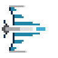

#  dogfight

## Getting Started

### Generate Code
```
protoc \
    --plugin=client/node_modules/.bin/protoc-gen-ts_proto \
    --proto_path=protos \
    --ts_proto_out=client/src/pb \
    protos/entities.proto protos/event.proto protos/join.proto protos/vector.proto

protoc \
    --plugin=client/node_modules/.bin/protoc-gen-ts_proto \
    --proto_path=protos \
    --go_out=server \
    protos/*.proto
```

### Start Client
```
cd client
npm run build
```

### Start Server
```
cd server

# load balancer
go run cmd/master/main.go

# game server
go run cmd/worker/main.go -port=5174
go run cmd/worker/main.go -port=5175
...
```
