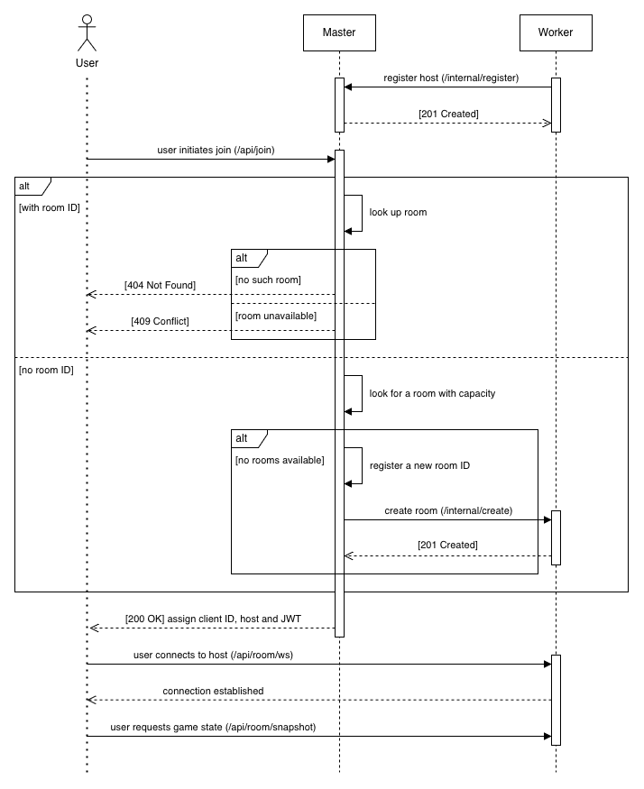

# Server

## Getting Started

### Generate Code
```
protoc \
    --plugin=client/node_modules/.bin/protoc-gen-ts_proto \
    --proto_path=protos \
    --go_out=server \
    protos/*.proto
```

### Start Server
```
# load balancer
go run cmd/master/main.go

# game server
go run cmd/worker/main.go -port=5174
go run cmd/worker/main.go -port=5175
...
```

## Design
The backend follows a Master-Worker pattern,
with a single load balancer (master) routing traffic to multiple game servers (workers).



### Load Balancer
The master server is responsible for assigning game servers to users.
It maintains its own registry of worker server hosts and game room IDs,
and decides how to route traffic based on the load on each worker.

It first looks for a room that has the capacity to fit more users.
If it doesn't find any, it will pick a worker server and instruct it to create a new room.

### Game Server
Each game server can support multiple rooms.
Users will first establish a WebSocket connection with the server.
Upon successful connection, the user will sync its game state with the server.
